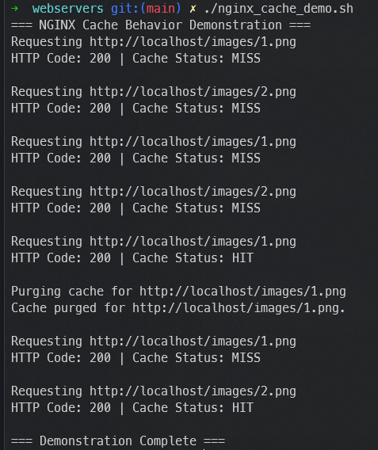

# prjctr-08-webservers

This project focuses on configuring Nginx for fine-tuning and optimizing its caching capabilities. The main objectives are:

## Project Requirements

1. **Cache Images Efficiently:** Configure Nginx to cache images that have been requested at least twice. This optimization aims to reduce server load and improve response times for frequently accessed images.
2. **Cache Invalidation:** Implement the ability to drop specific items from Nginx's cache upon request. The cache invalidation should target individual files without affecting the entire cache.

## How to Run the Project

To run the project, follow these steps:

1. Build the application:
   ```bash
   ./app/mill app.docker.build
   ```

2. Start the Docker containers using Docker Compose:
   ```bash
   docker-compose up -d
   ```

3. Execute the Nginx cache demo script:
   ```bash
   ./nginx_cache_demo.sh
   ```

These steps will set up and run the project, including the fine-tuned Nginx caching and cache invalidation features.

Please make sure you have the necessary dependencies and Docker installed before running the project.

## Result

When running `./nginx_cache_demo.sh` you should see the following: 
